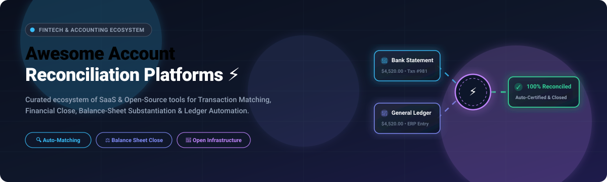

<p align="center">
  
</p>

<h1 align="center">⚡ Awesome Account Reconciliation Platforms</h1>

<p align="center">
  <strong>Curated ecosystem of SaaS Products & Open-Source Projects for Account Reconciliation, Automated Transaction Matching, Bank Reconciliation, Balance-Sheet Substantiation, Financial Close & Accounting Automation.</strong>
</p>

<p align="center">
  <a href="https://github.com/ishandutta2007/Awesome-Awesome-Awesome"></a><a href="https://discord.gg/jc4xtF58Ve"></a>
  <a href="https://github.com/ishandutta2007/Awesome-Account-Reconciliation-Platform/stargazers"></a>
  <a href="https://github.com/ishandutta2007/Awesome-Account-Reconciliation-Platform/network/members"></a>
  <a href="http://makeapullrequest.com"></a>
  <a href="LICENSE"></a>
  <a href="https://github.com/ishandutta2007"></a>
</p>

---

## 📖 Overview & SEO Keywords

Welcome to the definitive index of **Account Reconciliation Platforms** and **Transaction Matching Engines**.

This directory tracks solutions across:
- 🏦 **Bank Reconciliation**: Matching bank statement records, payment gateway settlements (Stripe, Adyen, PayPal), and credit card feeds against general ledgers.
- ⚖️ **Balance Sheet Reconciliation & Substantiation**: Automated certification, variance tracking, trial balance tie-outs, and SOX-compliant audit trails.
- 🔄 **High-Volume Transaction Matching**: 1:1, 1:N, N:1, and N:M deterministic, rule-based, and fuzzy matching for millions of records per hour.
- ⏱️ **Financial Close Automation**: Month-end close orchestration, checklist governance, journal entry posting, and flux analysis.
- 🏢 **Intercompany Reconciliation**: Entity-to-entity netting, discrepancy resolution, and multi-currency adjustments.
- 🛡️ **Exception Management & Case Handling**: AI-driven root cause categorization, review queues, and discrepancy resolution workflows.

---

## 📋 Table of Contents

- [☁️ SaaS & Hosted Platforms](#️-saas--hosted-platforms)
- [💻 Open-Source GitHub Projects](#-open-source-github-projects)
  - [🥇 Dedicated Reconciliation & Transaction Matching Engines](#-dedicated-reconciliation--transaction-matching-engines)
  - [🧩 Open-Source Accounting, ERP & Financial Management Platforms](#-open-source-accounting-erp--financial-management-platforms)
  - [🔧 Fuzzy Matching, Probabilistic Record Linkage & Comparison Toolkits](#-fuzzy-matching-probabilistic-record-linkage--comparison-toolkits)
  - [📊 High-Performance Financial Infrastructure & Programmable Ledgers](#-high-performance-financial-infrastructure--programmable-ledgers)
- [🏗️ Reference Architecture: Building an Open-Source Reconciliation Stack](#️-reference-architecture-building-an-open-source-reconciliation-stack)
- [🔍 Commercial SaaS vs Open-Source Comparison](#-commercial-saas-vs-open-source-comparison)
- [🤝 How to Contribute](#-how-to-contribute)
- [⭐ Star History](#-star-history)
- [⚠️ Disclaimer](#️-disclaimer)

---

# ☁️ SaaS & Hosted Platforms

> Sorted in **descending order** by **Company Size (Valuation / Revenue / Market Cap)**.

| Platform | Company Size (Valuation / Revenue) | Description | Starting Pricing | Free Tier / Free Trial Limits |
|---|---|---|---|---|
| **Fiserv Frontier Reconciliation** | **~$19.5B+ Annual Revenue** / ~$90B+ Market Cap (Fortune 500: FI) | Enterprise-grade institutional reconciliation and certification platform designed for high-volume banking, card networks, and multi-system financial operations. | Institutional enterprise contracts start at **~$100,000/year** (plus implementation & custom integration fees) | No free tier or self-serve trial; institutional discovery session and technical walkthrough available upon request |
| **OneStream** | **~$500M+ ARR** / ~$6.5B+ Market Cap (Public: OS) | Unified Corporate Performance Management (CPM) software providing financial close, consolidation, reporting, and automated account reconciliation. | Deployments start at **~$50,000 to $60,000/year** (scaled by user licenses, legal entities, and CPM apps) | No free tier or self-serve trial; customized solution demo and value assessment on request |
| **OneStream Account Reconciliations** | **~$500M+ ARR** / ~$6.5B+ Market Cap (Public: OS) | Native OneStream MarketPlace solution integrating balance-sheet substantiation directly into the core financial consolidation engine. | Available within OneStream CPM subscriptions (starting at **~$50,000/year**) | No free tier or self-serve trial; customized architecture walkthrough and live demo on request |
| **BlackLine** | **~$600M+ Annual Revenue** / ~$3.5B+ Market Cap (Public: BL) | Market-leading cloud platform automating balance sheet reconciliations, transaction matching, intercompany accounting, and month-end close. | Modular deployments start at **~$13,000 to $40,000/year** (median annual contracts range between $40,000–$77,000/year) | No free tier or self-serve trial; personalized live guided demo and ROI assessment available on request |
| **BlackLine Account Reconciliations** | **~$600M+ Annual Revenue** / ~$3.5B+ Market Cap (Public: BL) | Standardizes and automates balance-sheet account reconciliations, review certifications, and SOX-compliant audit trails. | Subscriptions start at **~$13,000/year** (priced per user seat, entity count, and ERP connector count) | No free tier or self-serve trial; sales-assisted evaluation demo available upon request |
| **BlackLine Transaction Matching** | **~$600M+ Annual Revenue** / ~$3.5B+ Market Cap (Public: BL) | High-speed matching engine capable of matching millions of daily bank, PSP, POS, and ERP transactions with configurable tolerances. | Module subscriptions start at **~$20,000/year** (scaled by transaction volume and rule complexity) | No free tier or self-serve trial; custom proof-of-concept demo using customer sample data on request |
| **HighRadius Account Reconciliation** | **~$3.1B Valuation** / ~$200M+ ARR (Late-stage Unicorn) | AI-powered autonomous finance software that automates balance sheet substantiation, anomaly detection, transaction matching, and journal entry generation. | Subscriptions start at **~$25,000/year** (available via annual SaaS subscription or Outcome-Based Pricing) | No free tier or self-serve trial; Outcome-Based Pricing available ($0 software subscription fees until platform go-live) |
| **Trintech** | **~$200M+ Annual Revenue** / ~$2B+ PE Valuation (Summit / TA) | Financial close and compliance automation leader delivering automated reconciliation workflows across the Cadency and Adra product lines. | Mid-market Adra packages start at **~$40,000/year**; enterprise Cadency tiers start at ~$75,000/year | No free tier or standard trial; scheduled product discovery and guided demo sessions on request |
| **Trintech Adra (Adra Suite)** | **~$200M+ Annual Revenue** / ~$2B+ PE Valuation (Summit / TA) | Modern financial-close suite purpose-built for mid-market teams, featuring automated matching, balance sheet certification, and task governance. | Entry deployments start at **~$40,000/year** (typically $40,000–$70,000/year based on entity count) | No free tier or self-serve trial; customized live product walkthrough provided upon request |
| **Cadency (by Trintech)** | **~$200M+ Annual Revenue** / ~$2B+ PE Valuation (Summit / TA) | Enterprise-grade close automation platform for large multinational enterprises with complex multi-ERP and multi-currency reconciliations. | Enterprise contracts start at **~$75,000/year** (scaled by entity count, ERP connections, and modules) | No free tier or self-serve trial; dedicated enterprise proof-of-concept and guided demo on request |
| **Trintech CadencyDirect** | **~$200M+ Annual Revenue** / ~$2B+ PE Valuation (Summit / TA) | Built natively on the ServiceNow platform, embedding Cadency financial close and reconciliation capabilities directly into enterprise service workflows. | Starts at **~$80,000/year** (plus required ServiceNow platform licensing) | No free tier or self-serve trial; ServiceNow partner-assisted live demonstration on request |
| **Adra Matcher** | **~$200M+ Annual Revenue** / ~$2B+ PE Valuation (Summit / TA) | High-speed automated transaction-matching tool within the Adra suite for bank, credit card, subledger, and payment gateway data. | Module packages start at **~$15,000/year** (as part of Adra suite deployment) | No free tier or trial; guided interactive demo available upon request |
| **Adra Balancer** | **~$200M+ Annual Revenue** / ~$2B+ PE Valuation (Summit / TA) | Balance-sheet reconciliation and review certification module providing automated reconciliation policies and digital sign-offs. | Module packages start at **~$15,000/year** (as part of Adra suite deployment) | No free tier or trial; live guided walkthrough and scoping demo on request |
| **FloQast** | **~$1.6B Valuation** / ~$120M+ ARR (Series E Unicorn) | Accounting workflow automation platform providing close checklists, trial-balance reconciliation tie-outs, and transaction matching. | Entry-level plans start at **~$12,000/year** (~$1,000/month billed annually for small accounting teams) | No free-forever plan or trial for core SaaS; FloQademy platform offers free CPE/CPD training courses with unlimited access |
| **FloQast Reconciliation Management** | **~$1.6B Valuation** / ~$120M+ ARR (Series E Unicorn) | Dedicated FloQast module automating balance sheet account substantiation directly tied to live ERP trial balances. | Included in FloQast packages starting at **~$12,000/year** (or ~$5,000/year as an add-on module) | No free tier or trial period; personalized 1-on-1 walkthrough demo available on request |
| **Duco** | **~$350M+ Valuation** / ~$30M+ ARR (Nordic Capital backed) | Cloud-native data automation and reconciliation platform specializing in high-volume, complex financial datasets, exceptions, and inter-system matching. | AWS Marketplace starter tiers start at **~$52,000/year** (average enterprise deployment is ~$183,000/year) | No free tier or self-serve trial; AWS Marketplace scoped sandbox pack available for evaluation |
| **Numeric** | **~$300M+ Valuation** / ~$10M+ ARR (Tier-1 VC Backed) | Next-gen AI-powered month-end close platform delivering automated balance sheet reconciliations, variance flux analysis, and ERP integrations. | Essentials tier starts at **$30/user/month** (billed annually; Growth/Enterprise tiers for live ERP sync & auto-rec) | No free tier or self-serve trial; live custom product demo and workflow scoping available upon request |
| **SmartStream TLM Reconciliation** | **~$100M+ Annual Revenue** (Acquired / Private Equity) | Tier-1 financial institution transaction-lifecycle management solution for high-volume cash, securities, collateral, and derivatives matching. | Enterprise institutional contracts start at **~$150,000/year** (scaled by transaction volume and modules) | No free tier or self-serve trial; institutional proof-of-concept and customized demo on request |
| **AutoRek** | **~$15M–$20M Annual Revenue** (SEP Backed) | Financial data management, payment reconciliation, and regulatory compliance platform used by global banks, insurance providers, and asset managers. | Deployments start at **~$45,000/year** (scaled by data volume, feeds, and regulatory modules) | No free tier or self-serve trial; consultative proof-of-value demo available on request |
| **SolveXia** | **~$10M–$15M Annual Revenue** (Bootstrapped / Growth) | Low-code automation platform for financial data transformation, automated reconciliations, variance analysis, and regulatory reporting workflows. | Starter plans start at **~$18,000/year** (~$1,500/month billed annually) | No free tier or self-serve trial; custom guided proof-of-concept demo available upon request |
| **ReconArt** | **~$5M–$10M Annual Revenue** (Privately Held) | Comprehensive reconciliation management software supporting transaction matching, balance sheet certification, and period-end close. | Essentials edition starts at **~$300/month** (billed annually; includes up to 25 million transactions/year) | No free-forever plan or self-serve trial; tailored interactive sandbox demo with sample data provided upon request |

---

# 💻 Open-Source GitHub Projects

Each open-source project is indexed with its live GitHub star count badge linking directly to its stargazers list and sorted in **descending order of stars**.

---

## 🥇 Dedicated Reconciliation & Transaction Matching Engines

Dedicated engines engineered specifically for matching records across banks, payment gateways, ERPs, and ledgers.

### [Hyperswitch](https://github.com/juspay/hyperswitch) [](https://github.com/juspay/hyperswitch/stargazers)
- 🚀 **Core Focus**: Open-source, high-performance financial payment switch and payment operations platform written in Rust.
- ⚡ **Reconciliation Highlights**: Includes built-in multi-processor reconciliation pipelines, fee auditing, refund tracking, settlement reconciliation, and unified dispute resolution.
- 📜 **License**: Apache-2.0

### [Midday](https://github.com/midday-ai/midday) [](https://github.com/midday-ai/midday/stargazers)
- 🚀 **Core Focus**: Modern all-in-one financial operating system with automated bank statement reconciliation, invoice matching, and transaction synchronization.
- ⚡ **Reconciliation Highlights**: Automated receipt-to-transaction matching, multi-bank feed reconciliation via Plaid/Teller/GoCardless, and live financial overview.
- 📜 **License**: Open Source

### [beancount-import](https://github.com/jbms/beancount-import) [](https://github.com/jbms/beancount-import/stargazers)
- 🚀 **Core Focus**: Semi-automated transaction import and reconciliation framework for Beancount plain-text accounting.
- ⚡ **Reconciliation Highlights**: Probabilistic payee matching, balance assertion verification, duplicate transaction detection, and interactive reconciliation UI.
- 📜 **License**: GPL-2.0

### [OCA Account Reconcile](https://github.com/OCA/account-reconcile) [](https://github.com/OCA/account-reconcile/stargazers)
- 🚀 **Core Focus**: Official Odoo Community Association (OCA) modules focused entirely on advanced financial reconciliation.
- ⚡ **Reconciliation Highlights**: Mass reconciliation wizards, automated reconciliation rules, payment matching, and bank statement line reconcilers.
- 📜 **License**: AGPL-3.0

### [Pavit Bank Reconciliation](https://github.com/pavitsu/pavit-bank-reconciliation) [](https://github.com/pavitsu/pavit-bank-reconciliation/stargazers)
- 🚀 **Core Focus**: Python-based desktop application for reconciling bank statement CSVs against internal general ledger exports.
- ⚡ **Reconciliation Highlights**: Automated date and amount tolerance matching, reference number parsing, and discrepancy export.
- 📜 **License**: MIT

### [Open Accounting](https://github.com/HMB-research/open-accounting) [](https://github.com/HMB-research/open-accounting/stargazers)
- 🚀 **Core Focus**: Self-hosted double-entry accounting software featuring integrated bank statement import and reconciliation flows.
- ⚡ **Reconciliation Highlights**: Statement ingestion, account reconciliation views, balance verification, and audit logs.
- 📜 **License**: MIT

### [Multi-Processor Payment Reconciliation](https://github.com/Etherlabs-dev/multi-processor-reconciliation) [](https://github.com/Etherlabs-dev/multi-processor-reconciliation/stargazers)
- 🚀 **Core Focus**: Workflow automation pipeline built with n8n and PostgreSQL for reconciling multi-processor payment receipts (Stripe, PayPal, Square, ACH).
- ⚡ **Reconciliation Highlights**: Fee deduction analysis, chargeback tracking, split payment matching, and QuickBooks sync.
- 📜 **License**: MIT

### [Agent for Accounting](https://github.com/FoundrySoftHQ/agent-for-accounting) [](https://github.com/FoundrySoftHQ/agent-for-accounting/stargazers)
- 🚀 **Core Focus**: Open-source accounting co-pilot featuring deterministic CSV comparison and transaction classification.
- ⚡ **Reconciliation Highlights**: Clear separation of timing differences, amount mismatches, splits, and unmatched exceptions.
- 📜 **License**: MIT

---

## 🧩 Open-Source Accounting, ERP & Financial Management Platforms

Full-scale accounting and ERP platforms that provide robust general ledgers, subledgers, bank feeds, and native reconciliation engines.

### [Odoo Community](https://github.com/odoo/odoo) [](https://github.com/odoo/odoo/stargazers)
- 🌟 **Stars**: 53,800+
- 🚀 **Capabilities**: Enterprise-grade business management suite featuring full double-entry accounting, electronic bank feeds, automated reconciliation models, and period-end close management.
- 📜 **License**: LGPL-3.0

### [ERPNext](https://github.com/frappe/erpnext) [](https://github.com/frappe/erpnext/stargazers)
- 🌟 **Stars**: 38,300+
- 🚀 **Capabilities**: 100% open-source ERP with comprehensive General Ledger, Accounts Receivable, Accounts Payable, Bank Statement Clearance, and Payment Reconciliation tools.
- 📜 **License**: GPL-3.0

### [Actual Budget](https://github.com/actualbudget/actual) [](https://github.com/actualbudget/actual/stargazers)
- 🌟 **Stars**: 28,200+
- 🚀 **Capabilities**: Local-first personal and small business financial system with automated bank synchronization, custom transaction rule engines, and account balance reconciliation.
- 📜 **License**: MIT

### [Firefly III](https://github.com/firefly-iii/firefly-iii) [](https://github.com/firefly-iii/firefly-iii/stargazers)
- 🌟 **Stars**: 24,300+
- 🚀 **Capabilities**: Self-hosted financial manager supporting double-entry bookkeeping, rule-based transaction imports, recurring transaction reconciliation, and financial reporting.
- 📜 **License**: AGPL-3.0

### [Akaunting](https://github.com/akaunting/akaunting) [](https://github.com/akaunting/akaunting/stargazers)
- 🌟 **Stars**: 10,000+
- 🚀 **Capabilities**: Modular accounting software for small businesses with bank account tracking, transaction categorization, and invoice reconciliation.
- 📜 **License**: GPL-3.0

### [Ghostfolio](https://github.com/ghostfolio/ghostfolio) [](https://github.com/ghostfolio/ghostfolio/stargazers)
- 🌟 **Stars**: 9,100+
- 🚀 **Capabilities**: Open-source wealth management and asset tracking platform with automated cash balance tracking, dividend reconciliation, and multi-broker transaction imports.
- 📜 **License**: AGPL-3.0

### [Ledger](https://github.com/ledger/ledger) [](https://github.com/ledger/ledger/stargazers)
- 🌟 **Stars**: 6,000+
- 🚀 **Capabilities**: High-performance, command-line double-entry accounting engine based on plain-text financial files, featuring strict balance assertions and automated transaction reconciliation commands.
- 📜 **License**: BSD-3-Clause

### [Beancount](https://github.com/beancount/beancount) [](https://github.com/beancount/beancount/stargazers)
- 🌟 **Stars**: 5,900+
- 🚀 **Capabilities**: Programmable plain-text double-entry bookkeeping system with strict balance validation assertions, custom Python plugins, and declarative syntax.
- 📜 **License**: GPL-2.0

### [Frappe Books](https://github.com/frappe/books) [](https://github.com/frappe/books/stargazers)
- 🌟 **Stars**: 4,800+
- 🚀 **Capabilities**: Desktop-first accounting application built by the Frappe team for small enterprises, featuring double-entry ledgers, invoicing, and payment reconciliation.
- 📜 **License**: AGPL-3.0

### [hledger](https://github.com/simonmichael/hledger) [](https://github.com/simonmichael/hledger/stargazers)
- 🌟 **Stars**: 4,600+
- 🚀 **Capabilities**: Fast, cross-platform plain-text accounting tool with dedicated balance assertion checking, CSV rule-based translation, and reconciliation commands.
- 📜 **License**: GPL-3.0

### [GnuCash](https://github.com/Gnucash/gnucash) [](https://github.com/Gnucash/gnucash/stargazers)
- 🌟 **Stars**: 4,300+
- 🚀 **Capabilities**: Established double-entry accounting software featuring an interactive checkbook-style reconciliation window, OFX/QIF bank imports, and scheduled transactions.
- 📜 **License**: GPL-2.0

### [Fava](https://github.com/beancount/fava) [](https://github.com/beancount/fava/stargazers)
- 🌟 **Stars**: 2,500+
- 🚀 **Capabilities**: Rich web interface for Beancount offering visual balance sheet substantiation, real-time trial balances, and transaction review tools.
- 📜 **License**: MIT

### [LedgerSMB](https://github.com/ledgersmb/LedgerSMB) [](https://github.com/ledgersmb/LedgerSMB/stargazers)
- 🌟 **Stars**: 550+
- 🚀 **Capabilities**: Full-featured open-source ERP and accounting system with SQL ledger database architecture, bank reconciliation wizards, and AR/AP matching.
- 📜 **License**: GPL-2.0

### [OpenBooks](https://github.com/braedonsaunders/openbooks) [](https://github.com/braedonsaunders/openbooks/stargazers)
- 🌟 **Stars**: 5+
- 🚀 **Capabilities**: Mid-market open-source accounting/ERP with a PostgreSQL-enforced double-entry ledger, multi-entity support, job costing, invoices, bills, inventory, approvals, and audit trail.
- 📜 **License**: AGPL-3.0

---

## 🔧 Fuzzy Matching, Probabilistic Record Linkage & Comparison Toolkits

Specialized data-matching libraries used to build custom transaction matching algorithms when identifiers, descriptions, and invoice numbers contain noise or variations.

### [Dedupe](https://github.com/dedupeio/dedupe) [](https://github.com/dedupeio/dedupe/stargazers)
- 🌟 **Stars**: 4,500+
- 🚀 **Capabilities**: Python library that uses machine learning to perform deduplication and entity resolution on messy customer names, merchant strings, and invoice descriptions.
- 📜 **License**: MIT

### [RapidFuzz](https://github.com/rapidfuzz/RapidFuzz) [](https://github.com/rapidfuzz/RapidFuzz/stargazers)
- 🌟 **Stars**: 4,000+
- 🚀 **Capabilities**: Ultra-fast C++ and Python string matching library with normalized Levenshtein, Jaro-Winkler, and token sorting algorithms for transaction memo matching.
- 📜 **License**: MIT

### [Splink](https://github.com/moj-analytical-services/splink) [](https://github.com/moj-analytical-services/splink/stargazers)
- 🌟 **Stars**: 2,300+
- 🚀 **Capabilities**: Fast, scalable probabilistic record linkage engine (Fellegi-Sunter methodology) powered by DuckDB, Spark, and SQLite to link millions of financial records.
- 📜 **License**: MIT

### [Record Linkage Toolkit](https://github.com/J535D165/recordlinkage) [](https://github.com/J535D165/recordlinkage/stargazers)
- 🌟 **Stars**: 1,000+
- 🚀 **Capabilities**: Python framework for linking records and entity resolution, providing indexing, string comparison, feature vectors, and machine learning classifiers.
- 📜 **License**: BSD-3-Clause

---

## 📊 High-Performance Financial Infrastructure & Programmable Ledgers

Distributed, immutable ledgers and payment backends that provide the audit-proof foundation underneath reconciliation systems.

### [TigerBeetle](https://github.com/tigerbeetle/tigerbeetle) [](https://github.com/tigerbeetle/tigerbeetle/stargazers)
- 🌟 **Stars**: 16,800+
- 🚀 **Capabilities**: Distributed financial accounting database designed to process hundreds of thousands of financial transfers per second with strict double-entry balance validation and zero data loss.
- 📜 **License**: Apache-2.0

### [Formance Ledger](https://github.com/formancehq/ledger) [](https://github.com/formancehq/ledger/stargazers)
- 🌟 **Stars**: 1,300+
- 🚀 **Capabilities**: Programmable double-entry ledger database optimized for financial operations, money flows, and automated multi-currency accounting rules.
- 📜 **License**: Apache-2.0

### [jPOS](https://github.com/jpos/jPOS) [](https://github.com/jpos/jPOS/stargazers)
- 🌟 **Stars**: 700+
- 🚀 **Capabilities**: Java platform for financial transactions implementing ISO-8583 standards, switch engines, transaction routing, and settlement processing.
- 📜 **License**: AGPL-3.0

### [Formance Stack](https://github.com/formancehq/stack) [](https://github.com/formancehq/stack/stargazers)
- 🌟 **Stars**: 500+
- 🚀 **Capabilities**: Open-source financial infrastructure framework connecting payment processors (Stripe, Wise, Modulr) to programmable accounting ledgers with built-in reconciliation flows.
- 📜 **License**: Apache-2.0

### [Medici](https://github.com/flash-oss/medici) [](https://github.com/flash-oss/medici/stargazers)
- 🌟 **Stars**: 350+
- 🚀 **Capabilities**: Double-entry bookkeeping library for Node.js using MongoDB, supporting transactions, balance tracking, and ledger reconciliation.
- 📜 **License**: MIT

---

# 🏗️ Reference Architecture: Building an Open-Source Reconciliation Stack

A production-grade reconciliation architecture requires data ingestion, normalization, matching, case handling, and financial close certification:

```text
                    ┌─────────────────────────────────────────┐
                    │               DATA SOURCES              │
                    │                                         │
                    │  🏦 Bank Feeds (Plaid / Teller / SFTP)  │
                    │  💳 Payment Gateways (Stripe / PayPal)  │
                    │  📊 ERPs / GLs (NetSuite / SAP / Odoo)  │
                    │  📁 Subledgers / Billing / CSV Imports  │
                    └────────────────────┬────────────────────┘
                                         │
                                         ▼
                    ┌─────────────────────────────────────────┐
                    │          DATA INGESTION & PIPELINE      │
                    │                                         │
                    │  • Webhooks & Real-Time Events          │
                    │  • Automated SFTP Batch Polling         │
                    │  • CDC (Change Data Capture)            │
                    │  • Extraction & Schema Mapping          │
                    └────────────────────┬────────────────────┘
                                         │
                                         ▼
                    ┌─────────────────────────────────────────┐
                    │       NORMALIZATION & ENRICHMENT        │
                    │                                         │
                    │  • Currency Conversion & FX Rates       │
                    │  • Date Formatting & Timezone Alignment │
                    │  • Merchant Cleaning (RapidFuzz/Dedupe) │
                    │  • Reference Number Parsing             │
                    └────────────────────┬────────────────────┘
                                         │
                                         ▼
               ┌─────────────────────────────────────────────────────┐
               │          RECONCILIATION MATCHING ENGINE             │
               │                                                     │
               │  [Phase 1] 1:1 Deterministic Exact Match            │
               │  [Phase 2] 1:N / N:1 Split & Group Match            │
               │  [Phase 3] Rule-Based & Date/Amount Tolerance Match │
               │  [Phase 4] Probabilistic & Fuzzy Record Linkage     │
               └──────────────────────────┬──────────────────────────┘
                                          │
                            ┌─────────────┴─────────────┐
                            │                           │
                            ▼                           ▼
                  ┌──────────────────┐        ┌──────────────────┐
                  │     MATCHED      │        │    EXCEPTIONS    │
                  │                  │        │                  │
                  │  • Auto-Cleared  │        │  • Unmatched Txn │
                  │  • Audit Trail   │        │  • Amount Diff   │
                  │  • Auto-Certified│        │  • Timing Lag    │
                  │  • High Conf.    │        │  • Duplicate     │
                  └─────────┬────────┘        └─────────┬────────┘
                            │                           │
                            │                           ▼
                            │                 ┌──────────────────┐
                            │                 │ EXCEPTION QUEUE  │
                            │                 │                  │
                            │                 │  • AI Copilot    │
                            │                 │  • Human Review  │
                            │                 │  • Adjustments   │
                            │                 │  • Write-Offs    │
                            │                 └─────────┬────────┘
                            │                           │
                            └─────────────┬─────────────┘
                                          │
                                          ▼
                    ┌─────────────────────────────────────────┐
                    │        FINANCIAL CLOSE & REPORTING      │
                    │                                         │
                    │  • Balance Sheet Account Substantiation │
                    │  • SOX & Regulatory Audit Evidence      │
                    │  • Discrepancy & Variance Flux Reports  │
                    │  • Period-End Journal Postings & Lock   │
                    └─────────────────────────────────────────┘
```

---

# 🔍 Commercial SaaS vs Open-Source Comparison

| Dimension | Commercial SaaS (BlackLine, FloQast, Numeric, Trintech) | Open-Source Stack (Odoo, TigerBeetle, Splink, Midday) |
|---|---|---|
| **Speed to Deployment** | ⚡ Weeks to months (out-of-the-box UI, certified ERP connectors) | 🛠️ Requires engineering setup, ingestion pipelines, and custom rule design |
| **Annual Cost** | 💰 $12,000 to $150,000+ / year recurring licenses | 💵 $0 software license; costs tied only to infrastructure and hosting |
| **Data Privacy & Control** | ☁️ Multi-tenant or single-tenant vendor cloud | 🔒 Complete data sovereignty; self-hostable in on-prem or VPC environments |
| **Custom Rule Flexibility**| ⚙️ Bounded by vendor UI rules and script engines | 💻 Infinite extensibility using Python, Rust, SQL, DuckDB, or machine learning |
| **Compliance & Audit** | 📋 Pre-packaged SOX, SOC 1/2 compliance reports | 🛡️ Must implement custom immutable audit trails and certification sign-offs |

---

## 🤝 How to Contribute

Contributions are welcome! To contribute:

1. 🍴 Fork this repository.
2. 🌿 Create your feature branch (`git checkout -b feature/awesome-platform`).
3. 📝 Add your tool with **specific starting pricing, free tier/trial details, company size, and GitHub star badge** (linked to stargazers).
4. 📬 Submit a Pull Request.

---

## ⭐ Star History

[](https://star-history.dera.page/#ishandutta2007/Awesome-Account-Reconciliation-Platform&type=date&legend=top-left)

---

## ⚠️ Disclaimer

*All product names, logos, brands, trademarks, and registered trademarks are property of their respective owners. Company valuations, revenues, and pricing estimates are compiled from publicly available disclosures, investor data, and market research.*
